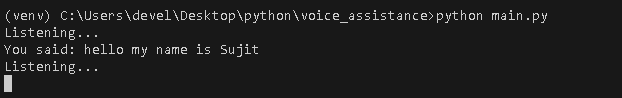

# Voice Command Assistant

A simple Python-based voice assistant that listens to your voice commands, processes them, and responds with speech.

## Features

- Listen to your voice using the microphone.
- Recognize speech using Google Speech Recognition API.
- Respond with speech using text-to-speech engine (`pyttsx3`).
- Supports basic commands like greeting, telling time, and exit.
- Easy to extend with your own commands.

## Requirements

- Python 3.6+
- Microphone (for input)

## Installation

### 1. Clone the repository or download the script:

```bash
git clone https://github.com/your-username/voice-command-assistant.git
cd voice-command-assistant
```

### 2. Create and activate a virtual environment (optional but recommended):
```bash
python -m venv venv
source venv/bin/activate       # Linux/macOS
venv\Scripts\activate          # Windows
```

### 3. Install dependencies:
```bash
pip install -r requirements.txt
```

## Output:
